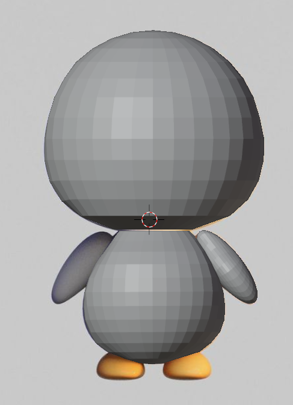

# Tecnología innmersiva
```
    <script src="https://aframe.io/releases/1.5.0/aframe.min.js"></script>
    <script src="https://unpkg.com/aframe-environment-component/dist/aframe-environment-component.min.js"></script>
    <script src="https://cdn.rawgit.com/donmccurdy/aframe-extras/v6.1.0/dist/aframe-extras.min.js"></script>
    <script src="https://cdn.rawgit.com/aframevr/aframe/v1.2.0/dist/aframe-html-shader.min.js"></script>
    <script src="https://cdn.jsdelivr.net/npm/@c-frame/aframe-physics-system@4.2.2/dist/aframe-physics-system.min.js"><script>
```
## Blender
Personajes en blender




## Tecnologías


